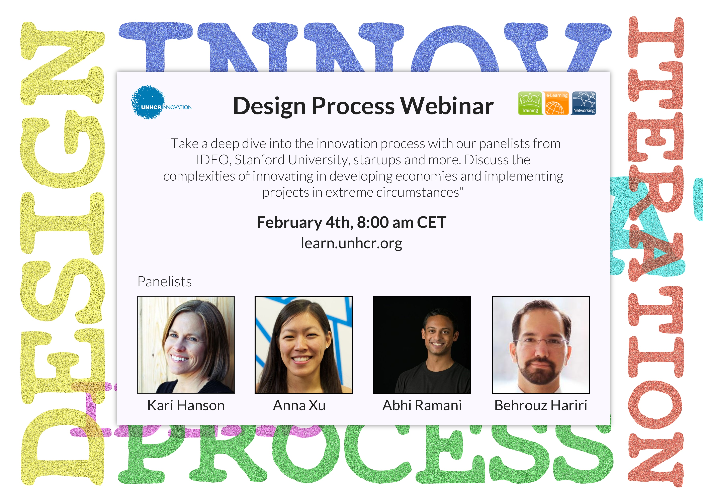

## Agenda

### Introduction

* What is UNHCR Innovation
* Brief introduction of each of the panel members
* What we'll discuss
  * Brief introduction of the innovation process (Human Centered Design)
  * Video of the [IDEO Shopping Cart](http://www.youtube.com/watch?v=M66ZU2PCIcM) with David Kelley
  * Q & A session with panel

### Panelists

* Abhi Ramani - R&D Engineer at Consure Medical in New Delhi India. He's a mechanical engineer and is interested in medical device innovation, global health and entrepreneurship. 
* Anna Xu -  Problem Solver at Tipping Point Community's T Lab, increasing access to early childhood education for San Francisco Bay Area's low-income families. She's been involved in several projects through Stanford's d.school, which range from improving communication with refugees to promoting patient care in rural India.
* Behrouz Hariri - Designer at IDEO. He's working on a very cool project called Drones for Health. IDEO.org is imagining a future where drones are used to solve humanitarian challenges, specifically towards last mile healthcare delivery.
* Kari Hanson - Startup advisor. She has worked with Stanford's Design for Extreme Affordability for six years now which has seen some really impressive products.

### Questions to panel

After seeing this video, IDEO makes going through the Innovation process easy and simple. In some ways though, innovating on a shopping cart is the ideal situation. In the beginning, IDEO goes through a phase of understanding their target user, ie the shopper. I'm interesting in hearing your experiences in understanding the user in situations where it might be more difficult than going to the nearest shopping mart. What challenges have you run into? How have you solved them?

Understanding the user is only half the battle. How do you iterate on your idea once you have it? Sometimes testing it on the community isn't an option, how do you adapt for this?

Rapid prototyping can be difficult if the idea isn't easily prototypable (such as ideas or systems, rather than products). What if any suggestions do you have for prototyping these harder, less tangible ideas?

Failure is a big part of succeeding. How do you tell when an innovation has failed? When do you scratch it and go back to the drawing board?

The man in the video speaks about hierarchy being inherently opposed to innovation. However, it's not always an option for us to ditch bureaucracy, especially in the UN. What are some tips to help mitigate bureaucracy or work with bureaucracy to foster innovation?

Lots of us don't always have the ability to fully implement the innovation process within our unit. How can we bring the innovation process to our work in little ways?

What are some caveats to innovation process that we aren't always aware of?

### Materials

* [IDEO Shopping Cart](http://www.youtube.com/watch?v=M66ZU2PCIcM)
* [HCD Connect](http://www.hcdconnect.org/) - Resources on the Innovation process

### Flyer

